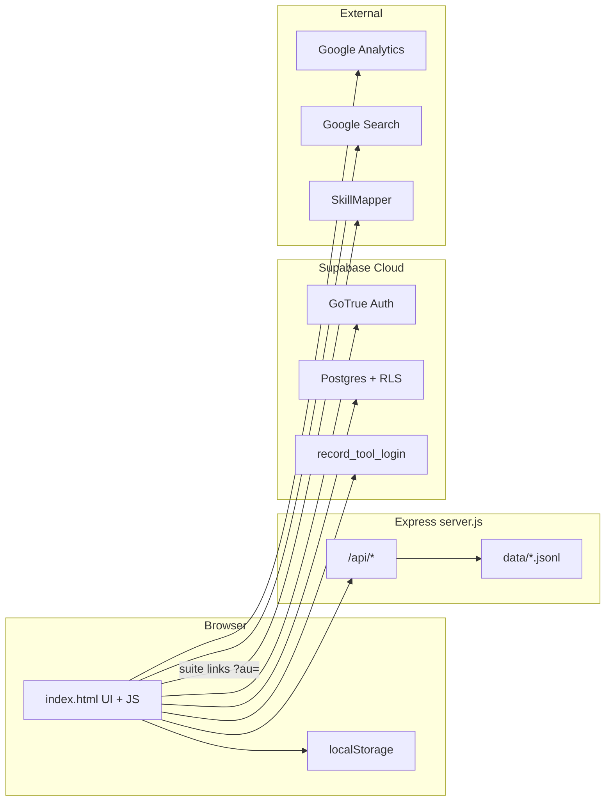
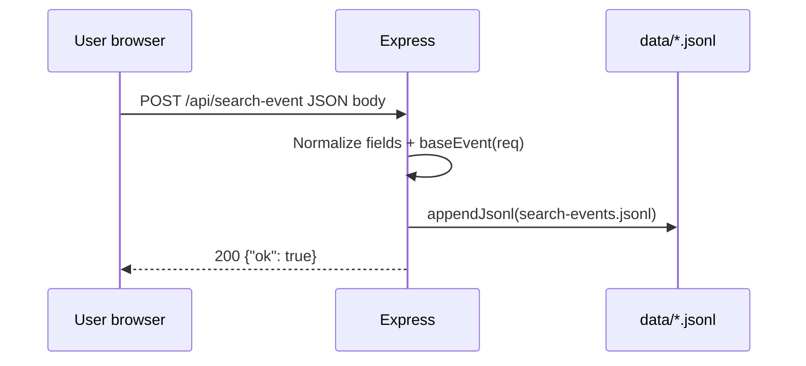
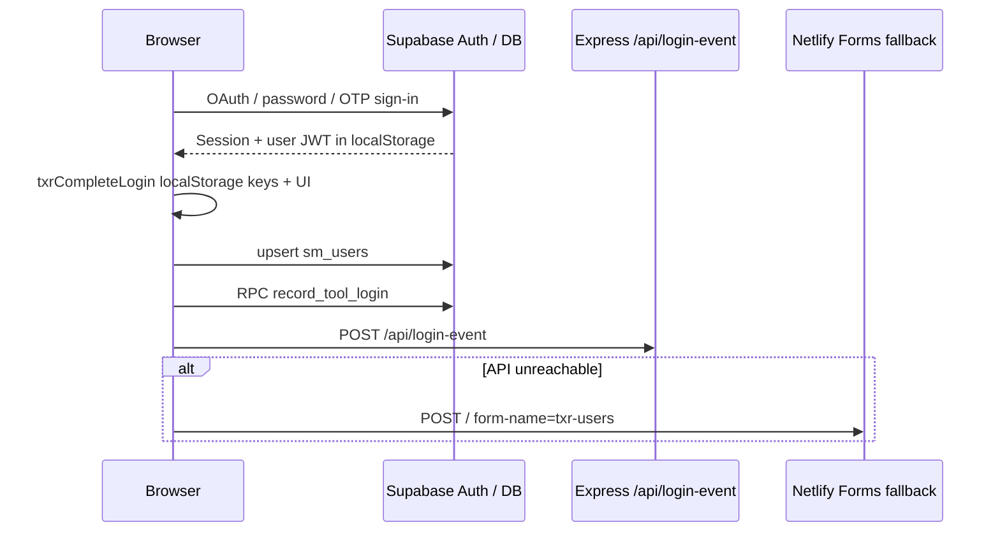
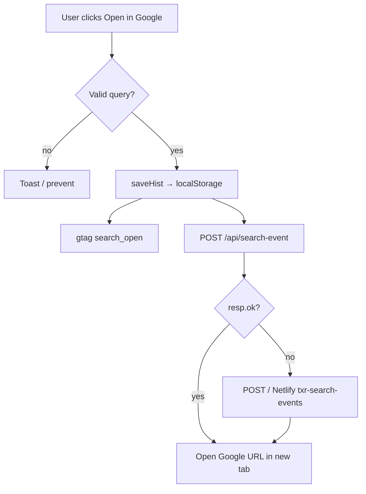

# TalentXray — System Context

This document summarizes the **TalentXray** codebase for onboarding. It reflects what is implemented **in this repository** plus reasonable inferences where server-side Supabase objects are referenced but not defined here.

---

## 1. Project Overview

**TalentXray** is a browser-based **Google X-Ray sourcing assistant**. Recruiters and sourcers configure constraints (job titles, seniority, locations, must-have vs nice-to-have skills, companies, exclusions) across **LinkedIn**, **GitHub**, and **Behance**. The app composes a boolean-style query string and a **Google Search URL** (`google.com/search?q=…`) so users open results in Google—not inside LinkedIn Recruiter.

The product sits in the **Talents Radar** suite: deep links pass the signed-in email to **SkillMapper** via query params for a smoother cross-tool experience.

---

## 2. Tech Stack

| Layer | Technology | Role in this repo |
|--------|------------|-------------------|
| **Frontend** | Single-page HTML (`index.html`), vanilla JavaScript | UI, query builder, auth glue, analytics hooks |
| **Styling** | Embedded `<style>` (CSS variables, responsive layout) | All visual design; no Tailwind/React |
| **Fonts** | Google Fonts (Outfit, JetBrains Mono) | Typography |
| **Backend** | **Node.js** + **Express** (`server.js`) | REST-ish JSON endpoints + static file hosting |
| **Config** | **dotenv** (optional `.env`) | `PORT` for local runs |
| **Auth & cloud DB** | **Supabase** (`@supabase/supabase-js` v2 via jsDelivr CDN) | OAuth (Google), email/password, OTP/magic links, password recovery; PostgREST table writes; Postgres RPC |
| **Primary DB (hosted)** | **PostgreSQL** (via Supabase) | Inferred: `sm_users` upserts and `record_tool_login` RPC |
| **Local persistence (analytics)** | **JSON Lines files** under `data/` | Append-only logs from Express (`*.jsonl`) |
| **Browser persistence** | `localStorage` | Session tokens (Supabase), user identity keys shared with SkillMapper, search history, saved templates |
| **Analytics** | **Google Analytics 4** (gtag) | Client-side events (`txrTrackEvent` → `gtag`) |
| **Static hosting / forms (optional)** | **Netlify Forms** | Hidden HTML forms + fallback `POST /` when `/api/*` is unreachable |

There is **no** traditional SPA framework (React/Vue/Svelte), **no** bundled build step, and **no** MySQL/MongoDB in-repo—the only relational usage visible here is **Supabase/Postgres**.

---

## 3. Architecture & Components

### 3.1 High-level shape

```
Browser (index.html + JS)
    ├── Static assets served by Express OR any static host
    ├── Calls Express APIs when deployed with Node (/api/*)
    └── Calls Supabase directly from the browser (anon key + RLS)

Express (server.js) — optional depending on deployment
    └── Writes append-only JSONL under data/
```

### 3.2 Major modules (logical, mostly inside `index.html`)

| Module / concern | Responsibility |
|------------------|----------------|
| **Query builder** | Maintains bubble arrays (titles, skills, locations, etc.), applies LinkedIn-specific rules (e.g. max three AND skills promoted to OR), builds final string + Google URL (`buildString`, `liveUpdate`). |
| **Platform handling** | Toggle LinkedIn/GitHub/Behance; LinkedIn subdomain selector; multi-platform output with per-platform links (`renderMultiPlatformOutput`). |
| **Skills & titles UX** | Large `SKILLS_DB`, job title list, autocomplete, keyboard navigation. |
| **Search history & templates** | Persists last ~20 searches and user-defined templates in `localStorage`; CSV export. |
| **URL prefill** | On `DOMContentLoaded`, reads query params (`role`, `must`, `nice`, etc.) to seed the builder. |
| **Login gate & modal** | Requires stored email / Supabase session before full tool use (`txrEnforceLoginGate`, modal UI). |
| **Identity bridging** | Reads/writes `txr_*`, `sm_*`, `tr_shared_*` keys; handles `?au=` email passthrough for SkillMapper. |
| **Supabase auth** | PKCE, persisted session in `localStorage`, OAuth redirect helpers tuned for prod vs localhost (`txrInitSupabaseAuth`, redirect URL helpers). |
| **Supabase data** | Upserts `sm_users`; RPC `record_tool_login` for tool login telemetry. |
| **Telemetry** | `txrTrackEvent` (GA), `txrPostJson` to `/api/*`, Netlify form fallback posts. |

### 3.3 Backend (`server.js`)

| Piece | Responsibility |
|-------|----------------|
| **`express.static(__dirname)`** | Serves `index.html`, `supabase-config.js`, and other root files. |
| **`POST /api/lead`** | Validates email + name; appends lead row to `data/leads.jsonl`. |
| **`POST /api/login-event`** | Validates email; appends login audit row to `data/login-events.jsonl`. |
| **`POST /api/search-event`** | Appends search/feedback rows to `data/search-events.jsonl`. |
| **`GET /api/health`** | Liveness JSON for ops/smoke tests. |

---

## 4. Third-Party Integrations

| Integration | Purpose |
|-------------|---------|
| **Supabase Auth** | Google OAuth, email/password, OTP, password reset; JWT/session in browser storage. |
| **Supabase Database API** | `.from('sm_users').upsert(...)` after login; aligns TalentXray identity with SkillMapper user rows (RLS assumed). |
| **Supabase RPC** | `record_tool_login` — server-defined function for cross-tool login logging (parameters: tool name, user agent, referrer). |
| **Google Search** | Execution surface for generated X-Ray queries (external tab). |
| **Google Analytics** | Product analytics via `gtag` events. |
| **Google Fonts** | Outfit + JetBrains Mono. |
| **jsDelivr** | CDN delivery of `@supabase/supabase-js`. |
| **SkillMapper** (`skillmapper.talentsradar.com`) | Linked from suite nav; receives `?au=<encoded_email>` for continuity (SkillMapper behavior is external to this repo). |
| **Netlify Forms** | Declared hidden forms (`txr-users`, `txr-leads`, `txr-search-events`); used when `/api/*` POST fails (fallback `fetch('/')`). |

LinkedIn/GitHub/Behance appear **only as Google `site:` / `intitle:` targets**, not as OAuth or scraping integrations.

---

## 5. Data Flow & Processing

### 5.1 Building a search

1. User edits chips/selectors → `liveUpdate()` runs `buildString()`.
2. `buildString()` produces `str` (query text) and `url` (`https://www.google.com/search?q=…&num=100`).
3. User clicks **Open in Google** → optional flush of pending title input → `saveHist()` writes to `localStorage`, `txrTrackEvent`, `txrLogSearchEvent` → browser navigates/opens Google.

### 5.2 Login and identity

1. **SkillMapper handoff**: Visiting with `?au=` seeds `txr_user_email` when absent.
2. **Shared localStorage**: Email/name may be recovered from `sm_user_*`, `tr_shared_*`, or parsed `sm_userbase` JSON before Supabase runs.
3. **Supabase**: On session (`SIGNED_IN`, `INITIAL_SESSION`, etc.), `txrCompleteLogin` syncs UI + shared keys + upserts `sm_users`, calls `record_tool_login`, posts `/api/login-event`, and optionally Netlify fallback.
4. **Logout**: Clears TalentXray/shared keys and signs out Supabase session.

### 5.3 Server-side event logs (when Express is running)

JSON body → validated/normalized strings → synchronous append to `data/*.jsonl` with server timestamp, IP (from `x-forwarded-for` if present), and User-Agent.

---

## 6. Workflow Diagrams (Mermaid)

### 6.1 Component interactions



### 6.2 Request/response lifecycle (API example)



### 6.3 Login + persistence flow



### 6.4 Search open + analytics flow



---

## 7. Assumptions & Notes

- **Supabase schema is not in this repo.** Table `sm_users` and RPC `record_tool_login` must exist and allow the anon role appropriately (typically via RLS policies or `SECURITY DEFINER` functions). Failures are logged to the console and do not block the UI.
- **Deployment modes differ:** With **only static hosting**, `/api/*` and `data/` logging will not run unless a separate backend is deployed; the code still attempts JSON POSTs and falls back to Netlify-style form posts.
- **Security model:** The Supabase anon key is intentionally public in the client; access control relies on **Supabase RLS** and auth—not on hiding `supabase-config.js`.
- **OAuth/email redirect URLs** must match entries in Supabase Auth settings; comments in code warn about `www`, paths, and preview hosts.
- **Inferred geography:** Comments and UI emphasize LinkedIn India subdomain for indexing; this is product guidance, not a hard technical constraint.

---

## 8. Repository File Reference

Purpose of each **tracked / intentional** project file and folder at the repo root (excluding `.git` internals).

| Path | Purpose |
|------|---------|
| **`index.html`** | Full application: layout, embedded CSS, HTML for tool + onboarding + login modal, and all client JavaScript (query engine, auth, analytics, Netlify forms). |
| **`server.js`** | Express app: JSON/body parsers, static hosting from project root, health check, and append-only logging APIs writing under `data/`. |
| **`package.json`** | Node metadata, `npm start` / `npm run dev` → `node server.js`, declares `express` and `dotenv`. |
| **`supabase-config.js`** | Assigns `window.__SKILLMAPPER_SUPABASE__` with Supabase project URL, anon/publishable key, and auth redirect base URL for production email/OAuth flows. |
| **`README.md`** | Quick start: install, run locally, lists API endpoints and `data/*.jsonl` behavior. |
| **`TESTING.md`** | Manual QA checklist: config validation, role OR logic, login, SkillMapper link param, session rehydrate, regressions, optional Supabase SQL check. |
| **`.env.example`** | Documents `PORT` for local Express; copy to `.env` if overriding the default port. |
| **`context.md`** | This onboarding / architecture summary (generated to document the system). |
| **`data/`** | **Created at runtime** when `server.js` handles write APIs: append-only JSONL files (`leads.jsonl`, `login-events.jsonl`, `search-events.jsonl`). Not always present before first local run. |

---

## 9. Quick local onboarding checklist

1. `npm install` then `npm run dev` → open `http://localhost:3000`.
2. Confirm `supabase-config.js` points to the correct Supabase project and redirect URLs are configured in Supabase.
3. Hit `GET /api/health` to verify Express is serving.
4. Sign in once and confirm browser network calls: Supabase auth, optional `sm_users` / `record_tool_login`, and `/api/login-event` if the Node server is active.

---

*Last updated from repository analysis; adjust this file when architecture or deployment targets change.*

---

## 10. Restructure note (June 2026)

The monolithic `index.html` was split into `client/` (Vite + vanilla ES modules) and `server/` (Express API). See README.md "Project structure" for the module map. Shared mutable state lives in `client/src/js/state.js`; inline `on*` handlers in HTML are exposed on `window` from `client/src/main.js`. Behavior is unchanged from the monolith except: the user chip now renders on first paint for identities seeded via `?au=`/shared localStorage (previously it silently skipped because the script ran before the DOM existed).
